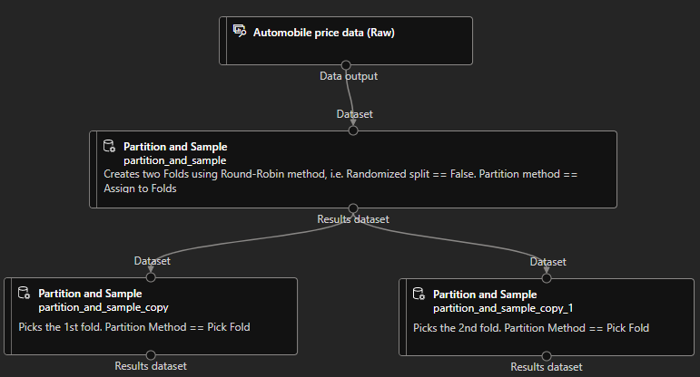

# Azure specific topics

## Docker & co.

__Hardware requirements__ to enable _WSL 2_:

* 4 GB RAM
* BIOS-Enabled virtualization
* Windows 10 64-bit

## Data Science Virtual Machine (DSVM) for Linux and Windows

[DSVM](https://learn.microsoft.com/en-us/azure/machine-learning/data-science-virtual-machine/overview) is a customized
image for Data science. Azure Machine Learning (AzureML) however, is an end-to-end platform. The DSVM offers more
flexibility. For instance, it supports more languages, RDP Access, windows etc.

Notes:

* PostgreSQL is installed by default on Ubuntu, hence on DSVM for Ubuntu.

## Compute

### Compute Cluster

Creation example:

```python
aml_comfig = AmlCompute.provisioning_configuration("STANDARD_D2_V2", min_nodes=0, max_nodes=2, vm_priority="dedicated")
compute = ComputeTarget.create(ws, "compute_name", aml_comfig)
compute.wait_for_completion(show_output=True)
```

Notes:

* Setting the _vm_priority_ to "lowpriority" may cause the cluster to be preempted due to capacity constraints
* if min_nodes > 0, returns only after there are min_nodes provisioned

### Compute Instance

Creation example:

```python
compute_instance_comfig = ComputeInstance.provisioning_configuration("STANDARD_D1_V2")
compute = ComputeTarget.create(ws, "compute_name", compute_instance_comfig)
compute.wait_for_completion(show_output=True)
```

## Storage

### Azure Blob Storage

It's a storage service that enables you to store big and unstructured data such as images and videos in a single
hierarchy. It also supports streaming of large files which need to be accessed quickly.

Copying data to or from _Azure Blob Storage_ is done via the following tools:

* Python
* Azure Storage Explorer
* SSIS
* AzCopy

**A Short note about Azure Data Lake Store (Gen2)**: It's a platform designed for big data analytics and offers a
hierarchical file system.

## Data Formats

* __ARFF(Attribute related file format)__ is used by Weka environment
    * __Weka__ is a collection of ML algorithms for data mining tasks on Windows Server 2019

## Azure Machine Learning Studio (Designer)

### Data Preparation Modules

* __Add columns__: Used to add a feature to the dataset.
* __Partition and Sample__: If the _Random Seed for Sampling_ parameter is set to 0, then the random seed is set based
  on the clock.
* __Group Data into Bins__: Converts continues features to categorical ones. Three important methods to bin
    * Quantiles (a.k.a. Equal height or Equal frequencies binning): Each bin has the same amount of observations as the
      other bins.
    * Equal width: The bins may have different observations, but have equal width - Used in histograms for example.
    * Entropy MDL:
        * Only available in ML Studio Classic
        * Requires a target column
* __Clean missing data__:
    * **MICE**: Refer to [Imputation techniques](###Imputation techniques).
    * **PCA**:
* __Convert to Indicator Values__: Performs One Hot Encoding
* __SMOTE__: Used for oversampling. It is better than simply duplicating the underrepresented rows.
* __Partition and Sample__: Partitions data into more datasets or creates a new sampled dataset. An example of
  partitioning data in two Folds is as below:



### Regression Modules

* __Poisson Regression__: A regression analysis used typically to model __counts__. E.g: Estimating the number of
  emergency service calls during an event. Projecting the number of customer inquiries after a promotion:
    * It has a poisson distribution.
    * It must be a whole number.
    * It must be positive number.

## Security

### Azure Role-Based Access Control (Azure RBAC)

* User roles
    * Owners
    * Contributors
    * Readers
* Custom roles
    * Example:

```json
    {
  "Name": "Data Scientist Custom",
  "IsCustom": true,
  "Description": "Can run experiment but can't create or delete compute or deploy production endpoints.",
  "Actions": [
    "Microsoft.MachineLearningServices/workspaces/*/read",
    "Microsoft.MachineLearningServices/workspaces/*/action",
    "Microsoft.MachineLearningServices/workspaces/*/delete",
    "Microsoft.MachineLearningServices/workspaces/*/write"
  ],
  "NotActions": [
    "Microsoft.MachineLearningServices/workspaces/delete",
    "Microsoft.MachineLearningServices/workspaces/write",
    "Microsoft.MachineLearningServices/workspaces/computes/*/write",
    "Microsoft.MachineLearningServices/workspaces/computes/*/delete",
    "Microsoft.Authorization/*",
    "Microsoft.MachineLearningServices/workspaces/computes/listKeys/action",
    "Microsoft.MachineLearningServices/workspaces/listKeys/action",
    "Microsoft.MachineLearningServices/workspaces/services/aks/write",
    "Microsoft.MachineLearningServices/workspaces/services/aks/delete",
    "Microsoft.MachineLearningServices/workspaces/endpoints/pipelines/write"
  ],
  "AssignableScopes": [
    "/subscriptions/<subscription_id>/resourceGroups/<resource_group_name>/providers/Microsoft.MachineLearningServices/workspaces/<workspace_name>"
  ]
}
```

## Monitor Data Drift

To monitor data drift over time one needs to register a _baseline_ and a _target_ dataset. The `backfill()` method of
the `DataDriftDetector` class is used to analyse the data drift between the baseline and target dataset.

## Azure Cognitive Services

These are cloud-based AI services available though REST APIs for the people without AI or Data Science skills or
knowledge.
Available services:

* Vision
* Speech
* Language
* Decision

# General Data Science topics

## Data Preprocessing

### Imputation techniques

* **Multivariate Imputation using Chained Equation (MICE)**: In contrast to uni-variate methods like _mean_, _median_
  etc. that look at only one column to fill the missing values of that column, this method takes other columns into
  consideration. Read
  this [article](https://www.numpyninja.com/post/mice-algorithm-to-impute-missing-values-in-a-dataset).

* **Last Observation Carried Forward**: The missing values are replaced by the last observed value.

### Feature Engineering

* **Feature Binning**: Conversion of continuous variables to categorical ones

    * Unsupervised Binning
        * Equal Width Binning
        * Frequency Width Binning (aka Equal Height Binning)

    * Supervised Binning
        * Entropy Based Binning

* **Feature Encoding**: Conversion of categorical variables to continuous ones
    * Label encoding
    * One Hot encoding

## Model Selection

### Time Series Data

* **Train-Test split**: Training dataset contains the values at the rear of the dataset and the rest is for test
  dataset. In other words, instead of randomly peaking data points from the dataset and assigning them we randomly
  choose a split point and assign the dates before the split point to the test dataset and the dates after the split
  point to the test dataset.

## Deep Learning

### Recurrent Neural Networks (RNNs)

These types of networks are designed to take sequences of text as inputs or return sequences of text as outputs, or
both. They're called recurrent because the network's hidden layers have a loop in which the output and cell state from
each time step become inputs at the next time step. This recurrence serves as a form of memory.
It allows contextual information to flow through the network so that relevant outputs from previous time steps can be
applied to network operations at the current time step.